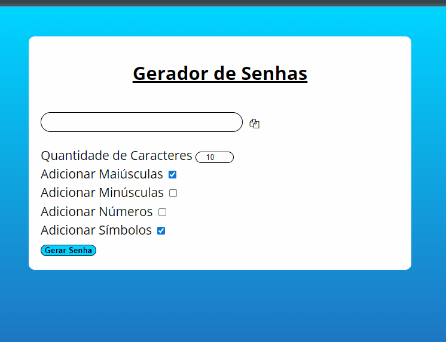

<h1 style="textDecoration = underline">Gerador de Senhas em JavaScript</h1>

<h2>⚙️Funcionamento</h2>

Para serem geradas as senhas, o projeto usa os códigos da tabela ASCII gerando aleatóriamente símbolos, números e letras, a escolha do usuário, possibilitando escolher tamanho da senha e copiar o campo. Em sua estrutura utiliza webpack e babel, como forma se suporte a navegadores legados e também utiliza sistema de módulos, para organizar melhor o entendimento geral do projeto.

 
🔗[Clique aqui para acessar](https://password-generator-js-three.vercel.app/)  

<h3>🛠️Tecnologias utilizadas</h3>

* JavaScript
* HTML
* CSS
* Visual Studio Code

<h3>📞 Contato</h3>

📩E-mail: pedrohgs2004@gmail.com  
🌐Linkedin: https://www.linkedin.com/in/pedro-henrique-g-silva-a2100a23a/?originalSubdomain=br
